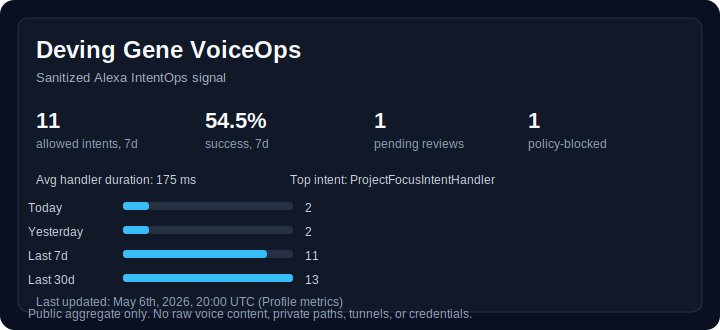
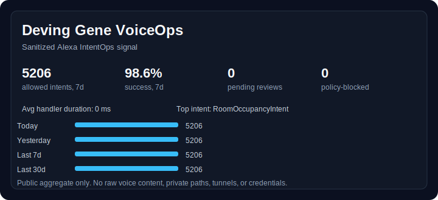
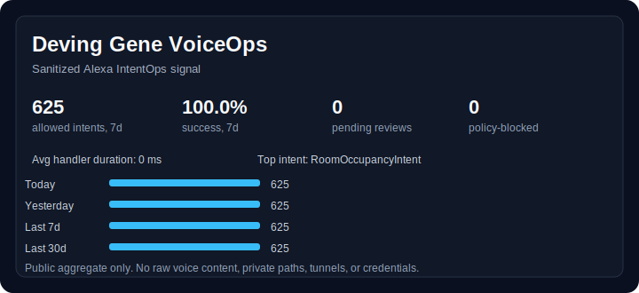
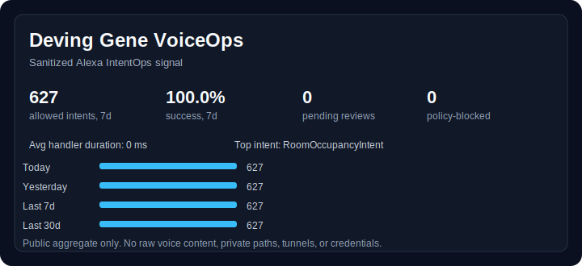

  

  

  

  
  
  
  

  <b>Featured Projects</b> 
  

  <b>Languages</b> 
  
  
  
  
  
  

  <b>Platforms & Tooling</b> 
  
  
  
  
  

  <b>Analysis Stack</b> 
  
  
  
  
  

  🌓 Building systems that balance creativity, reliability, data quality, and human-centered AI.

---

## Yooo, I'm Rob ☯ 👋

I'm a systems-minded developer, analytics builder, and research-curious technologist with a B.S. in Information Technology and 8+ years of experience building measurable systems across Roblox / UGC platforms.

### About My Work
My work sits at the intersection of:

- **Product + Growth analytics**
- **Gameplay / LiveOps telemetry**
- **Local-first AI workflow automation**
- **Cloud-aware systems tooling**
- **Human-centered computing**
- **Biofeedback / neurofeedback research curiosity**

I build projects that connect **software systems, user behavior, data quality, and decision-making** — from live game telemetry and onboarding funnels to local-first AI workflows that help preserve focus, reduce context loss, and make developer activity more reviewable.

I am especially interested in:

- 🧠 **AI-augmented workflows** for focus, context hygiene, and neurodivergent-aware productivity support  
- 📊 **Product / growth analytics** across onboarding, retention, economy, acquisition, and LiveOps loops  
- ⚙️ **Systems reliability** through clean APIs, state handling, workflow automation, and validation-first tooling  
- 🧬 **Emerging research areas** like biofeedback, neurotechnology, cognitive science, longevity research, and human-centered AI  

### 🧠 Current Focus & Research Interests

I am highly research-curious, focusing on the intersection of **human physiology, artificial intelligence, and systems resilience**. My goal is to build environments that reduce friction, support neurodivergent profiles, and elevate human output.

> **Status:** I am currently building **[Deving Gene](https://github.com/RobGonWin/deving-gene)** as my primary focus while actively seeking full-time roles across Data Analytics, Systems Engineering, and AI Platform integration.

* **Physiological Telemetry & Biofeedback:** I am actively researching how to integrate real-time EEG and EKG data streams to monitor cognitive load and flow states. I am particularly interested in the application of devices like the **Polar H10, Muse S Athena, BrainAccess HALO, and other upcoming devices** to create adaptive, local-first environments that provide metacognitive scaffolding.

## 🚧 Featured Work

<table>
  <tr>
    <td width="50%" valign="top">
      <h3>🧠 <a href="https://github.com/RobGonWin/deving-gene" style="color: inherit; text-decoration: none;">Deving Gene</a></h3>
      
A consent-first workflow system designed to support neurodivergent focus. It combines Python/FastAPI services, local dashboards, and AWS/Alexa IoT integration. Built to utilize LLMs to sanitize SSML and leverage RAG for dynamic understanding of user states and flow preservation.

      
<b>Stack:</b> Python, JavaScript, Alexa, GitHub Actions

      <a href="https://github.com/RobGonWin/deving-gene"><b>View Repository ➔</b></a>
    </td>
    <td width="50%" valign="top">
      <h3>🎮 <a href="https://www.roblox.com/games/14835231599/1v1-Edit-Arena" style="color: inherit; text-decoration: none;">1v1 Edit Arena</a></h3>
      
Self-started UGC experience powered by a fully custom engine written in Luau from scratch. Engineered with end-to-end telemetry instrumented across onboarding, economy, retention, acquisition, and gameplay telemetry.

      
<b>Signals:</b> 389% performance increase, 84% FTUE completion, 13.5m play-time

      <a href="https://www.roblox.com/games/14835231599/1v1-Edit-Arena"><b>Play / View ➔</b></a>
    </td>
  </tr>
  <tr>
    <td width="50%" valign="top">
      <h3>📊 <a href="https://github.com/RobGonWin/opendota-liveops-telemetry-warehouse" style="color: inherit; text-decoration: none;">OpenDota LiveOps Warehouse</a></h3>
      
Bounded telemetry warehouse pipeline modeling hero stability, volatility, watchlists, and returning-player proxies for stakeholder-ready LiveOps review.

      
<b>Stack:</b> Python, Snowflake, dbt, Tableau-ready exports

      <a href="https://github.com/RobGonWin/opendota-liveops-telemetry-warehouse"><b>View Repository ➔</b></a>
    </td>
    <td width="50%" valign="top">
      <h3>🧬 <a href="https://github.com/RobGonWin/biofeedback-signal-lab" style="color: inherit; text-decoration: none;">Biofeedback Signal Lab</a></h3>
      
Local-first biosignal analytics workflow focused on window coverage checks, pipeline validation, curated tables, and cautious non-diagnostic review.

      
<b>Stack:</b> PhysioNet, DuckDB, dbt, Streamlit

      <a href="https://github.com/RobGonWin/biofeedback-signal-lab"><b>View Repository ➔</b></a>
    </td>
  </tr>
</table>

  

---

<!--DEVING_GENE_VOICEOPS:start-->
### Deving Gene VoiceOps Signal

  

  

  
  

| Window | Allowed intents | Success | Pending reviews | Policy-blocked | Avg latency |
| --- | ---: | ---: | ---: | ---: | ---: |
| Today | 2 | 100.0% | 0 | 0 | 160 ms |
| Yesterday | 2 | 0.0% | 0 | 0 | 230 ms |
| Last 7d | 11 | 54.5% | 1 | 1 | 175 ms |
| Last 30d | 13 | 61.5% | 1 | 1 | 173 ms |
| Last 365d | 13 | 61.5% | 1 | 1 | 173 ms |

Top allowed intents, last 7d: ProjectFocusIntentHandler (4), DayScheduleIntentHandler (2), PomodoroStatusIntentHandler (2).

#### Public Alexa Metrics Timeline

4 public batches &middot; 9808 imported allowed intents &middot; 1914 saved Alexa Metrics API requests &middot; no live API calls during README refresh.

| Batch | Window | Stage | Locale | Allowed intents | API requests | Top intent | Links |
| --- | --- | --- | --- | ---: | ---: | --- | --- |
| batch_01_2025-03-01_to_2025-05-16 | 2025-03-01 to 2025-05-16 | development | en-US | 5206 | 870 | RoomOccupancyIntent (1656) | <a href="assets/metrics/public_batches/batch_01_2025-03-01_to_2025-05-16/outputs/deving_gene_voiceops_profile.public.json">profile</a> / <a href="assets/metrics/public_batches/batch_01_2025-03-01_to_2025-05-16/outputs/alexa_metrics_v2_normalized.latest.json">latest</a> / <a href="assets/metrics/public_batches/batch_01_2025-03-01_to_2025-05-16/outputs/deving_gene_voiceops_profile_card.svg">card</a> / <a href="assets/metrics/public_batches/batch_01_2025-03-01_to_2025-05-16/outputs/deving_gene_voiceops_profile_block.md">block</a> |
| batch_02_2025-04-03_to_2025-04-30 | 2025-04-03 to 2025-04-30 | development | en-US | 3350 | 464 | RoomOccupancyIntent (724) | <a href="assets/metrics/public_batches/batch_02_2025-04-03_to_2025-04-30/outputs/deving_gene_voiceops_profile.public.json">profile</a> / <a href="assets/metrics/public_batches/batch_02_2025-04-03_to_2025-04-30/outputs/alexa_metrics_v2_normalized.latest.json">latest</a> / <a href="assets/metrics/public_batches/batch_02_2025-04-03_to_2025-04-30/outputs/deving_gene_voiceops_profile_card.svg">card</a> / <a href="assets/metrics/public_batches/batch_02_2025-04-03_to_2025-04-30/outputs/deving_gene_voiceops_profile_block.md">block</a> |
| batch_03_2025-07-01_to_2025-07-31 | 2025-07-01 to 2025-07-31 | development | en-US | 625 | 290 | RoomOccupancyIntent (248) | <a href="assets/metrics/public_batches/batch_03_2025-07-01_to_2025-07-31/outputs/deving_gene_voiceops_profile.public.json">profile</a> / <a href="assets/metrics/public_batches/batch_03_2025-07-01_to_2025-07-31/outputs/alexa_metrics_v2_normalized.latest.json">latest</a> / <a href="assets/metrics/public_batches/batch_03_2025-07-01_to_2025-07-31/outputs/deving_gene_voiceops_profile_card.svg">card</a> / <a href="assets/metrics/public_batches/batch_03_2025-07-01_to_2025-07-31/outputs/deving_gene_voiceops_profile_block.md">block</a> |
| batch_04_2025-08-30_to_2025-09-30 | 2025-08-30 to 2025-09-30 | development | en-US | 627 | 290 | RoomOccupancyIntent (357) | <a href="assets/metrics/public_batches/batch_04_2025-08-30_to_2025-09-30/outputs/deving_gene_voiceops_profile.public.json">profile</a> / <a href="assets/metrics/public_batches/batch_04_2025-08-30_to_2025-09-30/outputs/alexa_metrics_v2_normalized.latest.json">latest</a> / <a href="assets/metrics/public_batches/batch_04_2025-08-30_to_2025-09-30/outputs/deving_gene_voiceops_profile_card.svg">card</a> / <a href="assets/metrics/public_batches/batch_04_2025-08-30_to_2025-09-30/outputs/deving_gene_voiceops_profile_block.md">block</a> |

Batch 1 - March 1st, 2025->May 16th, 2025

- **Stage / locale:** development / en-US
- **Imported allowed intents:** 5206
- **Alexa Metrics API requests:** 870
- **Top intents:** RoomOccupancyIntent (1656), PomodoroStatusIntent (509), PCAwakeIntent (460), ReflectionIntent (430), CurrentTaskIntent (402), StartPomodoroTimerIntent (286), NextTasksIntent (218), AMAZON.YesIntent (185), ProcrastinationIntent (183), AMAZON.FallbackIntent (128)
- **Public artifacts:** <a href="assets/metrics/public_batches/batch_01_2025-03-01_to_2025-05-16/outputs/deving_gene_voiceops_profile.public.json">profile JSON</a> &middot; <a href="assets/metrics/public_batches/batch_01_2025-03-01_to_2025-05-16/outputs/alexa_metrics_v2_normalized.latest.json">latest normalized JSON</a> &middot; <a href="assets/metrics/public_batches/batch_01_2025-03-01_to_2025-05-16/outputs/alexa_metrics_v2_normalized.live.json">live normalized JSON</a> &middot; <a href="assets/metrics/public_batches/batch_01_2025-03-01_to_2025-05-16/outputs/deving_gene_voiceops_profile_card.svg">SVG card</a> &middot; <a href="assets/metrics/public_batches/batch_01_2025-03-01_to_2025-05-16/outputs/deving_gene_voiceops_profile_block.md">rendered block</a>

Batch 2 - April 3rd, 2025->April 30th, 2025

- **Stage / locale:** development / en-US
- **Imported allowed intents:** 3350
- **Alexa Metrics API requests:** 464
- **Top intents:** RoomOccupancyIntent (724), PomodoroStatusIntent (442), PCAwakeIntent (414), StartPomodoroTimerIntent (262), CurrentTaskIntent (254), ReflectionIntent (244), AMAZON.YesIntent (152), NextTasksIntent (138), CancelPomodoroIntent (98), ClearSessionIntent (98)
- **Public artifacts:** <a href="assets/metrics/public_batches/batch_02_2025-04-03_to_2025-04-30/outputs/deving_gene_voiceops_profile.public.json">profile JSON</a> &middot; <a href="assets/metrics/public_batches/batch_02_2025-04-03_to_2025-04-30/outputs/alexa_metrics_v2_normalized.latest.json">latest normalized JSON</a> &middot; <a href="assets/metrics/public_batches/batch_02_2025-04-03_to_2025-04-30/outputs/alexa_metrics_v2_normalized.live.json">live normalized JSON</a> &middot; <a href="assets/metrics/public_batches/batch_02_2025-04-03_to_2025-04-30/outputs/deving_gene_voiceops_profile_card.svg">SVG card</a> &middot; <a href="assets/metrics/public_batches/batch_02_2025-04-03_to_2025-04-30/outputs/deving_gene_voiceops_profile_block.md">rendered block</a>

Batch 3 - July 1st, 2025->July 31st, 2025

- **Stage / locale:** development / en-US
- **Imported allowed intents:** 625
- **Alexa Metrics API requests:** 290
- **Top intents:** RoomOccupancyIntent (248), ReflectionIntent (105), ProcrastinationIntent (52), CurrentTaskIntent (34), AutoStartIntent (28), AMAZON.YesIntent (21), ClearSessionIntent (21), NextTasksIntent (19), PomodoroStatusIntent (18), JumpBlockBackIntent (17)
- **Public artifacts:** <a href="assets/metrics/public_batches/batch_03_2025-07-01_to_2025-07-31/outputs/deving_gene_voiceops_profile.public.json">profile JSON</a> &middot; <a href="assets/metrics/public_batches/batch_03_2025-07-01_to_2025-07-31/outputs/alexa_metrics_v2_normalized.latest.json">latest normalized JSON</a> &middot; <a href="assets/metrics/public_batches/batch_03_2025-07-01_to_2025-07-31/outputs/alexa_metrics_v2_normalized.live.json">live normalized JSON</a> &middot; <a href="assets/metrics/public_batches/batch_03_2025-07-01_to_2025-07-31/outputs/deving_gene_voiceops_profile_card.svg">SVG card</a> &middot; <a href="assets/metrics/public_batches/batch_03_2025-07-01_to_2025-07-31/outputs/deving_gene_voiceops_profile_block.md">rendered block</a>

Batch 4 - August 30th, 2025->September 30th, 2025

- **Stage / locale:** development / en-US
- **Imported allowed intents:** 627
- **Alexa Metrics API requests:** 290
- **Top intents:** RoomOccupancyIntent (357), ReflectionIntent (91), ProcrastinationIntent (44), AutoStartIntent (19), CurrentTaskIntent (18), AMAZON.FallbackIntent (16), PomodoroStatusIntent (12), AMAZON.NoIntent (10), DayScheduleIntent (10), NextTasksIntent (10)
- **Public artifacts:** <a href="assets/metrics/public_batches/batch_04_2025-08-30_to_2025-09-30/outputs/deving_gene_voiceops_profile.public.json">profile JSON</a> &middot; <a href="assets/metrics/public_batches/batch_04_2025-08-30_to_2025-09-30/outputs/alexa_metrics_v2_normalized.latest.json">latest normalized JSON</a> &middot; <a href="assets/metrics/public_batches/batch_04_2025-08-30_to_2025-09-30/outputs/alexa_metrics_v2_normalized.live.json">live normalized JSON</a> &middot; <a href="assets/metrics/public_batches/batch_04_2025-08-30_to_2025-09-30/outputs/deving_gene_voiceops_profile_card.svg">SVG card</a> &middot; <a href="assets/metrics/public_batches/batch_04_2025-08-30_to_2025-09-30/outputs/deving_gene_voiceops_profile_block.md">rendered block</a>

Public aggregate only: no raw voice content, SSML, transcripts, private project names, local paths, tunnel URLs, tokens, credentials, or live Alexa credentials. Local export paths are published only as REDACTED_PUBLIC_EXPORT_PATH.
<!--DEVING_GENE_VOICEOPS:end-->

---

---

<!--RECENT_ACTIVITY:start-->
- Starred [webrecorder/archiveweb.page](https://github.com/webrecorder/archiveweb.page)
- Starred [alexa/alexa-skills-kit-sdk-for-nodejs](https://github.com/alexa/alexa-skills-kit-sdk-for-nodejs)
- Pushed 0 commits to [RobGonWin/deving-gene](https://github.com/RobGonWin/deving-gene) — `commit`
- Starred [BtbN/FFmpeg-Builds](https://github.com/BtbN/FFmpeg-Builds)
- Starred [youssefadly237/yt-comment-dl](https://github.com/youssefadly237/yt-comment-dl)
<!--RECENT_ACTIVITY:end-->

<!--PROFILE_UPDATE:start-->

  Last auto-updated: May 21, 2026 · 12:23 PM EDT / 16:23 UTC · Next scheduled update: May 22, 2026 · 9:23 AM EDT / 13:23 UTC

<!--PROFILE_UPDATE:end-->
